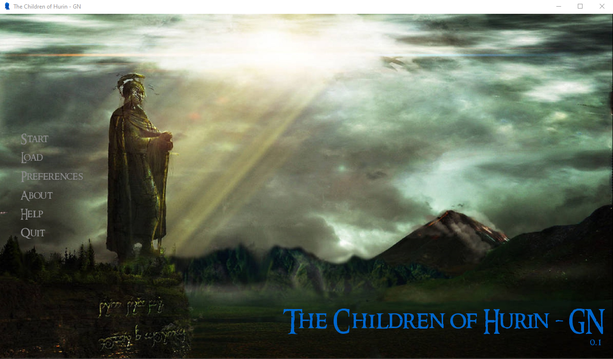
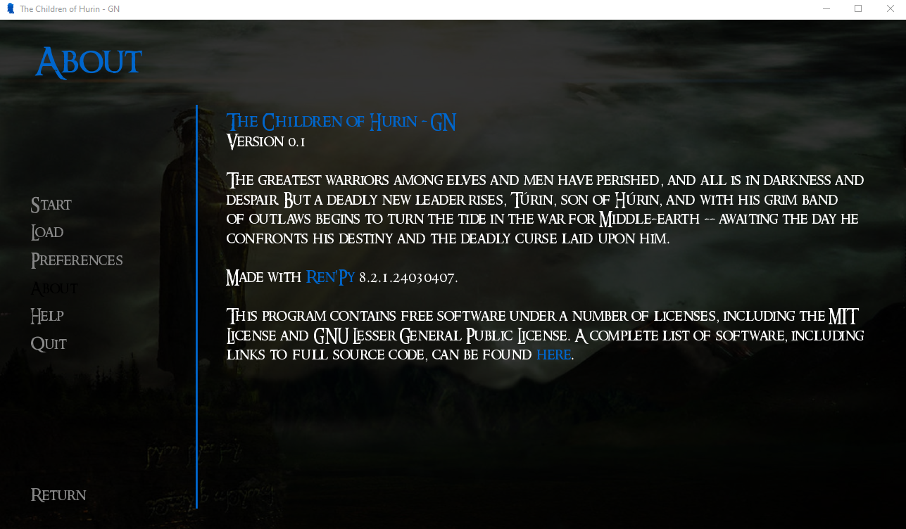

# testprojectrenpy // The Children of Hurin
## First attempt at playing with a storyboard tool called Ren'Py
##### Because I'm a massive nerd I've chosen to do parts of The Children of Hurin written by JRR Tolkien
##### I have chosen to use Ren'Py as it enables me to brush off some rust (I haven't used Python for a good 10 years)

### Handy command for me 
##### git add * && git commit -m "COMMIT MESSAGE HERE" && git push
###### I am not expecting nor wanting any monetary compensation. All assets and sources used belong to their original creators